# Lesson: Digital & Serious Games

### First and Last Name: ΘΕΟΦΙΛΟΣ ΣΑΒΒΙΔΗΣ 
### University Registration Number: dpsd19115
### GitHub Personal Profile: https://github.com/Tsavvis
### Digital & Serious Games Personal Repository: https://github.com/Tsavvis/Role-Playing-Game

# Introduction

Η εργασία εστιάζει στη δημιουργία ενός ψηφιακού παιχνιδιού που θα μπορεί να παιχτεί από browser και html5.Το παιχνίδι φτιάχνεται χρησιμοποιώντας το προγραμμα του Unity ενώ τα assets που χρησιμοποιούνται εχουν φτιαχτεί από εμένα χρησμοποιώντας το προγραμμα Aseprite, που εστιάζει στη δημιουργία έργων τύππου Pixel art.  
Μερικά χρήσιμα links αποτελούν κανάλια στο Youtube που εστιάζουν σε παρόμοιου τύπου περιεχόμενο: 
https://www.youtube.com/c/AdamCYounis 
https://www.youtube.com/c/PeterMilko 
https://www.youtube.com/c/MortMort

# Summary

Το παιχνίδι που κατασκευάζω είναι ένα κλασσικό top down rpg με θεματική επηρεασμένη από το Halloween και τον Ιρλανδικό μύθο του Dullahan, του ακέφαλου καβαλλάρη, μόνο που στην περίπτωσή μας ο πρωταγωνιστής έχει κεφάλι κολοκύθας. Το πλάνο για το παιχνίδι περιλαμβάνει δυο πίστες, μία εισαγωγική με έναν απλό δρόμο που θα είναι γεμάτος με εκθρικούς και φιλικούς NPC και θα έχει στόχο την εισαγωγή του παίχτη στο κλίμα του παιχνιδιού. Το δεύτερο κομμάτι του παιχνιδιού περιλαμβάνει μία δεύτερη πίστα στο εσωτερικό ενός κάστρου. Το κάστρο θα έχει εκθρούς και αν είναι εφικτό και ένα τελικό Boss.

# 1st Deliverable

 
Ξεκινάμε λοιπόν, με την δημιουργία ενός νέου project στο Unity και ακολουθώντας τις οδηγίες του tutorial (:https://learn.unity.com/tutorial/main-character-and-first-script?uv=2020.3&projectId=5c6166dbedbc2a0021b1bc7c) κατάφερα να φτίαξω τον κώδικα για να μετακινώ τον χαρακτήρα μου 
Κατευθείαν άνοιξα το Aseprite για να δημιουργήσω τους δικους μου χαρακτήρες. Αρχικά ήθελα να φτιάξω τον καβαλλάρη όπως τον γνωρίζουμε από τον μύθο, πάνω δηλαδη στο άλογό του. 
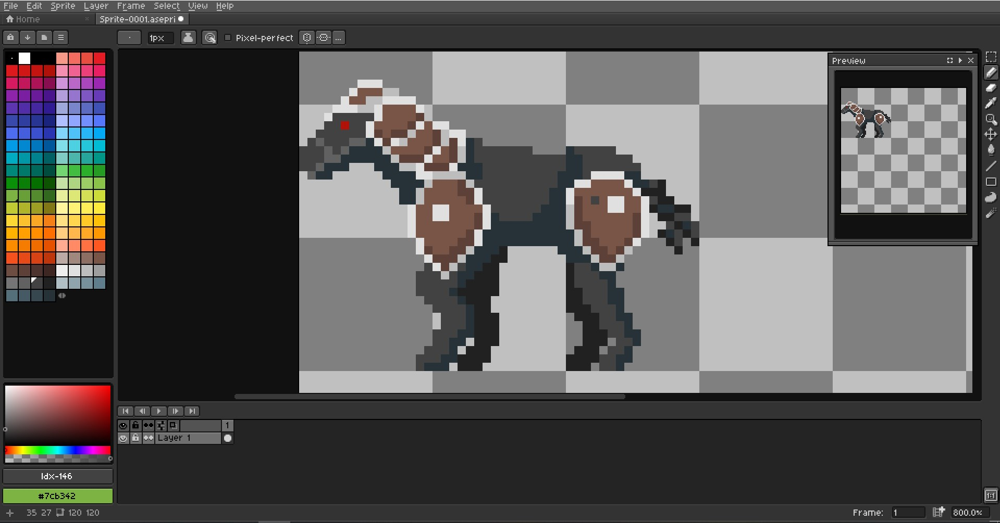  
Δυστυχώς συνειδητοποίησα ότι αργότερα, στη δημιουργία των animations θα χρειαζόταν πολύ παραπάνω προσοχή και χρόνος, οπότε αποφάσισα ότι για αυτή την εκδοχή, ο καβαλλάρης μας θα αφήσει το άλογό του και ίσως βρεθεί κάποια ιστορία που να συνοδεύει αυτή την εξέλιξη. 
Στη συνέχεια δημιούργησα τα δικά μου tiles συνεχίζοντας το tutorial και παρακολουθώντας βοηθητικά βίντεο. Μερικά από τα πρώτα αποτελέσματα είναι τα εξής: 

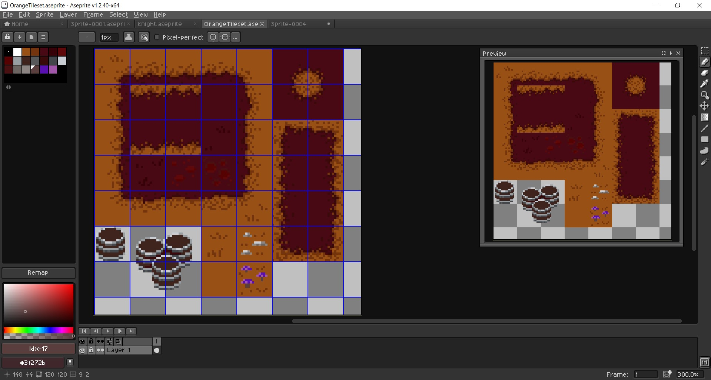

Και με την εισαγωγή τους στο Unity: 

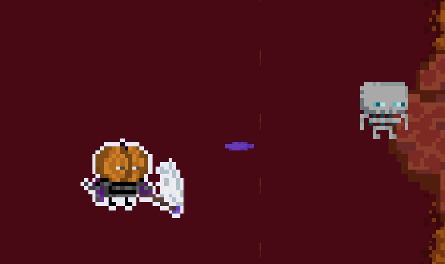

Ο τελικός χαρακτήρας είναι ο εξής: 
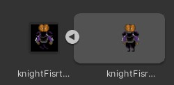 
...καθώς και όλα τα τελικά assets που χρησιμοποιούνται έως τώρα: 
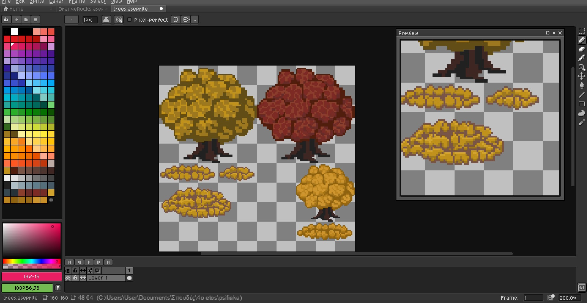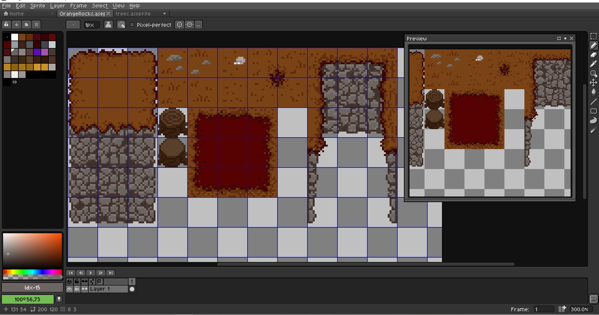 
 
Στο πεταξύ επιχείρησα να προσθέσω κάτι παραπάνω στην κάμερα του παιχνιδιού ακολουθώντας το tutorial για το cinemachine (https://learn.unity.com/tutorial/camera-cinemachine?uv=2020.3&projectId=5c6166dbedbc2a0021b1bc7c). Ο λόγος που το πρόσθεσα από τόσο νωρίς είναι για να μπορέσω να δω ποιες περιοχές θα μπορούν οι παίχτες όντως να δούνε, γλιτώνοντας χρόνο στη διακόσμηση ασχετων περιοχών.
 
Ο τελικός χάρτης για το πρώτο σταδιο μέχρι στιγμής είναι ο εξής: 
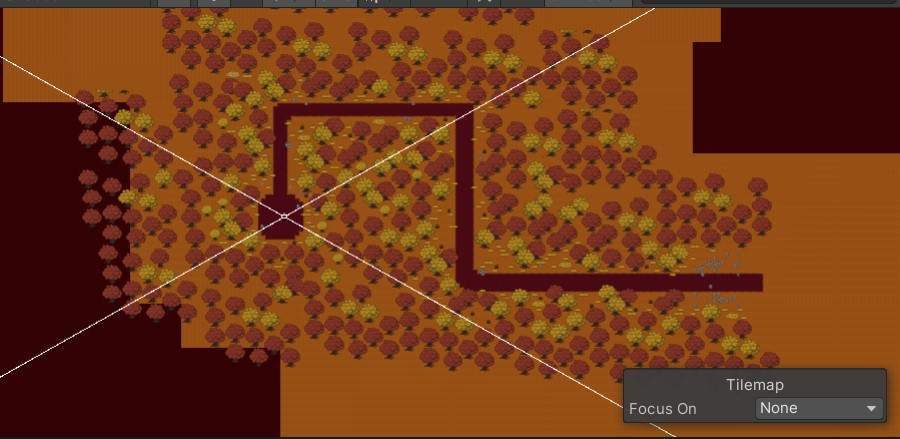 
Ενδέχεται να γίνουν αλλαγές μέχρι το δεύτερο και το τρίτο παραδοτέο ενώ ταυτόχρονα ετοιμάζω τα assets για το δεύτερο επίπεδο και το τελικό Boss. 
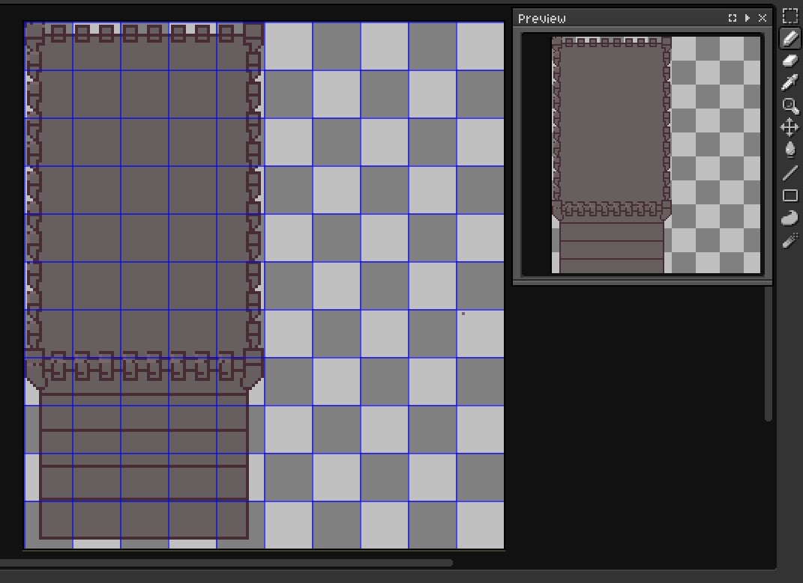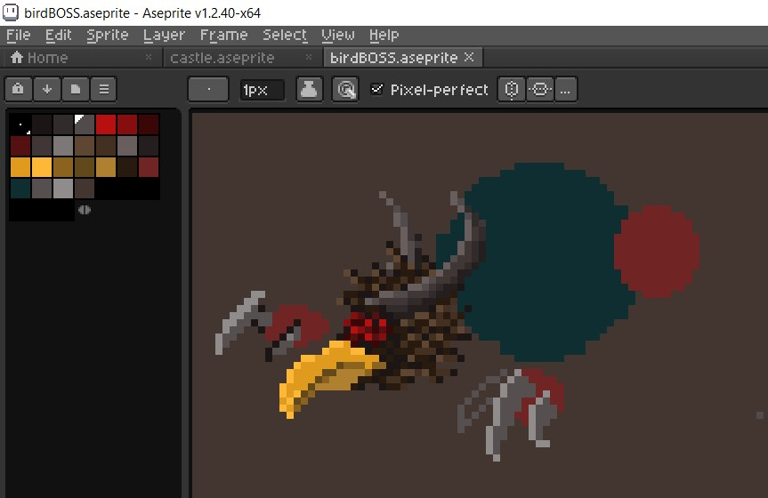 

# 2nd Deliverable

Το παραδοτέο είναι ημιτελές καθώς όσο το εφτιαχνα, ένα compiling error μου προκάλεσε όλο το project να διαγραφτεί. Με λίγα λόγια έπρεπε να φτιαχτεί από την αρχή και αυτά είναι όσα πρόλαβα να παραδώσω. 
Αρχικά βρήκα έναν ευκολο τρόπονα κολλησω την κάμερα στον παίχτη και να τον ακολουθεί. Το αποτέλεσμα ήταν πιο επιθυμητό από αυτό που δίνει το tutorial καθώς δεν ήθελα το ελαφρύ delay της κάμερας. Με λίγα λόγια απλά έκανα drag and drop την κάμερα στον χαρακτηρα μου.
 
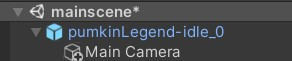
Έπειτα, έφτιαξα το blend tree για τον χαρακτηρα μου και αντίστοιχα για τα skeletons enemies. 
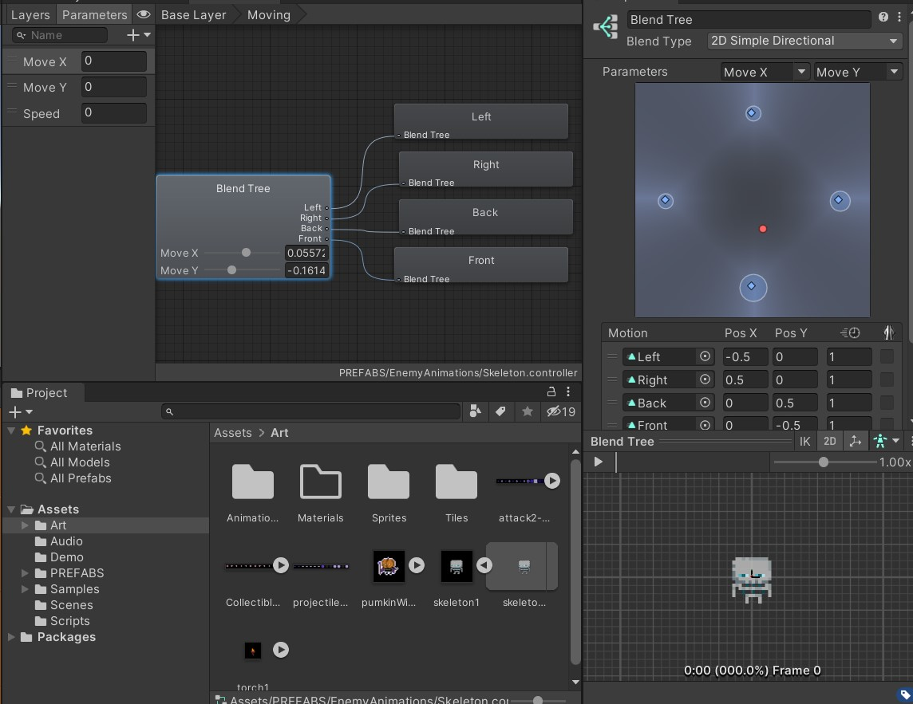 
Ετοίμασα τα colliders για όλα τα δέντρα και decors του χάρτη και άλλαξα ελάχιστα το μονοπάτι. Η τελική μορφή του χάρτη θα είναι έτοιμη στο τρίτο παραδοτέο . 
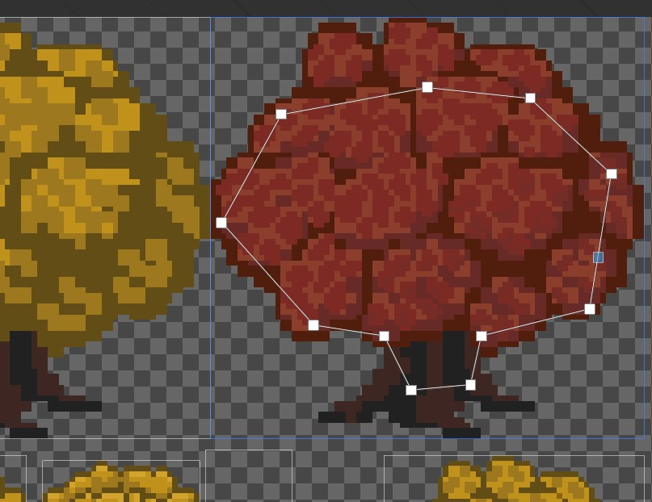 
Τέλος, κατάφερα να κάνω τα projectiles να εκτοξεύονται απ τον παίχτη αν και για την ώρα δε σκοτώνουν τον αντίπαλο. 
 

# 3rd Deliverable 

# Conclusions

# Sources
